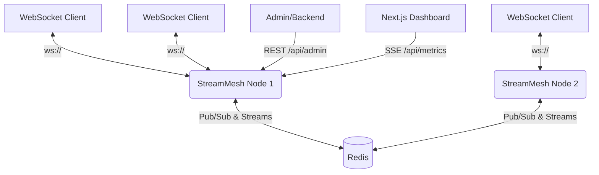

# 🌐 StreamMesh

A distributed, high-concurrency real-time event broker and WebSocket gateway written in Go. It enables multi-node message fan-out backed by Redis streams, built for serving thousands of concurrent interactive UI connections with low latency and low memory footprint.

## Features

- **High-Concurrency Connection Manager**: Handles 50,000+ open WebSockets per node using `gobwas/ws` (zero-allocation parser).
- **Multi-Node Fan-Out**: Powered by Redis Streams, allowing horizontal scalability. Publish a message on Node A and it instantly reaches subscribers on Node B.
- **Token-Bucket Rate Limiting**: Built-in protection against socket flooding and DDoS attacks using atomic operations.
- **Real-Time Telemetry & Developer Dashboard**: Next.js 14 dashboard streaming live throughput (msg/s), p50/p90/p99 latencies, and cluster topology directly via SSE (Server-Sent Events).
- **REST Admin API**: Programmatically inspect topics, active connections, and cluster health.

## Architecture



## Quick Start (Production Deployment)

Run the entire stack locally using Docker Compose:

```bash
docker-compose up --build -d
```

Services will be exposed at:
- **StreamMesh API & WebSocket**: `http://localhost:8080`
- **Dashboard**: `http://localhost:3000`
- **Redis**: `localhost:6379`

## Local Development

### 1. Start Redis
Make sure Redis is running locally on port 6379.
```bash
docker run -p 6379:6379 -d redis
```

### 2. Start the Backend
```bash
go run ./cmd/streammesh
```

### 3. Start the Dashboard
```bash
cd dashboard
npm install
npm run dev
```

## REST API Reference

### Publish Message
```bash
POST /api/admin/publish
Content-Type: application/json

{
  "topic": "system-alerts",
  "payload": { "status": "critical" }
}
```

### Get Active Channels
```bash
GET /api/admin/channels
```

### Get Connected Clients
```bash
GET /api/admin/connections
```

### Get Cluster Topology
```bash
GET /api/admin/cluster
```

## WebSocket API

Connect to the gateway:
```javascript
const ws = new WebSocket('ws://localhost:8080/ws?user_id=123');

ws.onopen = () => {
    // Subscribe to a topic
    ws.send(JSON.stringify({
        action: 'subscribe',
        topic: 'live-updates'
    }));
    
    // Publish to a topic
    ws.send(JSON.stringify({
        action: 'publish',
        topic: 'chat-room',
        payload: { text: 'Hello, World!' }
    }));
};
```

## Load Testing
A script is included to benchmark the WebSocket gateway.

```bash
go run scripts/loadtest.go -c 1000 -d 10s -t test-topic
```

Options:
- `-c`: Number of concurrent connections (default 1000)
- `-d`: Duration (default 10s)
- `-t`: Topic to subscribe to (default `test-topic`)
- `-url`: WebSocket endpoint (default `ws://localhost:8080/ws?user_id=loadtester`)
