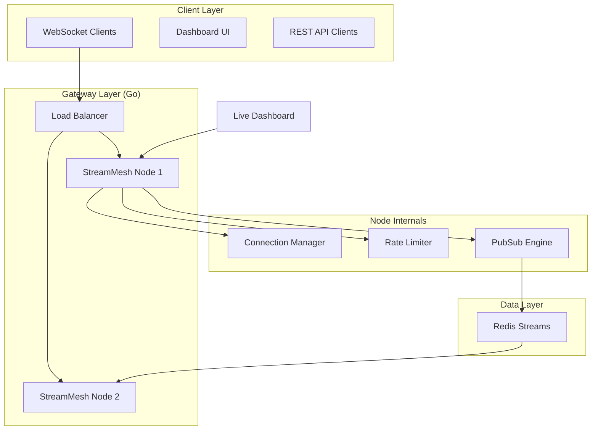

# 🌐 StreamMesh

**StreamMesh** is a distributed real-time event broker and WebSocket gateway designed to handle large-scale concurrent connections (50k+). It provides a seamless pub/sub system across multiple nodes using Redis Streams and gRPC.

## Features
- **High-Concurrency WebSocket Gateway:** Built with Go to handle 50k+ active connections efficiently.
- **Distributed Pub/Sub:** Uses Redis Streams and gRPC to fan out messages across a cluster of StreamMesh nodes.
- **Token-Bucket Rate Limiting:** Prevents flooding and DDoS via atomic-level token bucket rate limiting.
- **Heartbeat & Zombie Pruning:** Automatically tracks active connections and prunes dead ones to save memory.
- **Developer Dashboard:** Real-time metrics dashboard built with Next.js, featuring Recharts for live throughput monitoring.

## Architecture

## Getting Started

1. Clone the repository.
2. Run `docker-compose up -d` to spin up the required Redis instances.
3. Start the server: `make run`.
4. Open the dashboard at `http://localhost:3000`.
